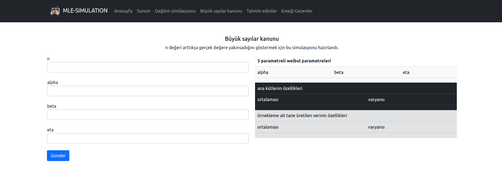

# Contents
1. <b>Sunum:</b>Presentation for my homework

 
2. <b>Tahmin ediciler -Estimators:</b>estimators for three weibull parameters
 

 
3. <b> Dağılım simülasyonu-Distribution simulation:</b>show the behave of three weibull parameters when parameters is changed

 

 

4. <b>Büyük sayılar kanunu:</b> show when sample size is changed the distribution of three weibull parameters ,it estimate clearly parameters from generated data (which build from three weibull distribution)
 

